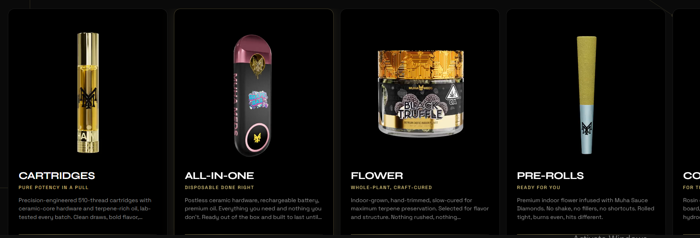

Please i want us to create a Luxerious Ecommernce website on vapes, now i have gone to stitch to produce me how i want my interface to be, the screenshots i have attached them there please the interface should be thesame as what is in the screenshot. 
PLease make sure to produce me but exaclty what is in does screenshot, and the backgroung image there is in this folder called Backgroung image.md.
and please for the product section i want it to be very similar to how this my other site: in the admin dashboard the admin should be able to create new group of products that will appear infront of the site like this  ( each groups like for example in that imge there are product grouped ass all.in.one, flowers, Pre-rolls etc..) and also the admin can should be able to create a sub group in the group like in the group ( all in one we have melted Diamonds, live Resin etc like this site https://www.muhameds.com/products/all-in-one  ) and the admin should be able to add images delete and alot of stuff.
Do a full study on this site https://www.muhameds.com/ mostly the products sections please like how all the rpoducts are placed how it was grouped luxery, even how they images react all their description and the rest. 
Now for example in the folder of images there which i downloaded from the site and i want you to use the images, now we have a group of vape called all-in-one where there is a small video of the type beside rotaing ( the admin should be able to upload and edit plus the descriptions) now when u click the all-in-one you still see sub groups like melted diamonds and the rest ... please that is how i need it to be, please their descriptions please do it well please..
the should be a place holder to put the price of the product please ( products in the sub groups please)
please the cleint can browse the site browse the products, and add to cart
please make sure you go to this site https://www.muhameds.com/ mostly the products section please 